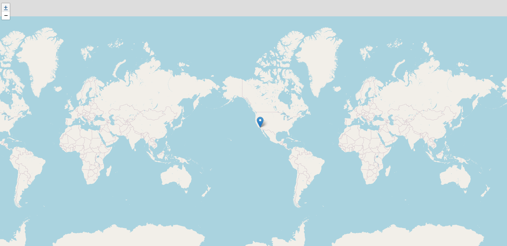
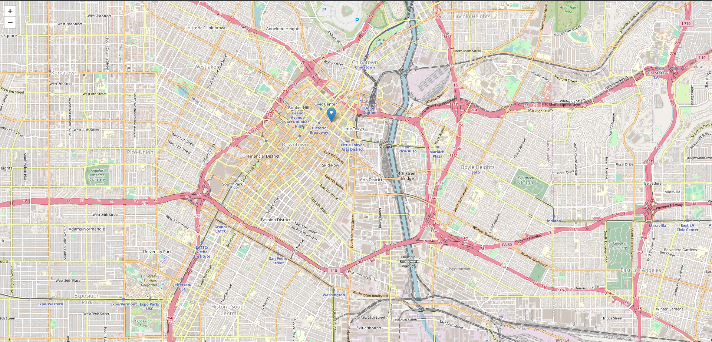

<h1 align="center" id="title">📡 T r a x O s i n t  </h1><br>


[](https://www.python.org/downloads/)
[](https://www.gnu.org/licenses/gpl-3.0.fr.html)


# **TraxOsint is an OSINT tool for track ip adress**

# **😇 Abouts TraxOsint**
> TraxOsint is an open source tool based on the search for information on an ip address.
> TraxOsint uses several services, API to have more results and to be able to compare them afterwards to have a more precise result


**🔥 Features of script**
- fully async
- asynchrone scraping 
- menu in cli format (commands)

**🔥 Skills**
- checking ip valid or not
- ping
- checking open ports (8080, 80, 443) # you can add
- checking if ip is affiliated with ProtonVPN
- check if the ip is in a paste
- organization
- a.s.
- i.s.p.
- hostname
- continent
- country
- region
- city
- latitude              # scraped of ipinfo
- longitude             # scraped of ipinfo
- creation of map

**modules**
Name                 |         Domain                        |          
| ------------------- | --------------------------------------  
| [Proton](https://proton.me) | proton.me
| [Ip-api](https://ip-api.com/)             | ip-api.com
| [Ipinfo](https://ipinfo.io)             | ipinfo.io 
| [IpWhois](https://ipwhois.io/)             |  ipwhois.io                         
| [Pastebin](https://pastebin.com/)             |  pastebin.com


## **🛠️ Requirements / Launch**

- [Python 3](https://www.python.org/downloads/)

**For 💻 Windows:**
```
$ git clone https://github.com/N0rz3/TraxOsint.git
$ cd ./TraxOsint
$ install.bat
```

**For 🐧 Linux and others:**
```
$ git clone https://github.com/N0rz3/TraxOsint.git
$ cd ./TraxOsint
$ pip3 install -r requirements.txt
```

**📚 Usage:**
```
usage: traxosint.py [-h] [ip]

positional arguments:
  ip          gives all the information TraxOsint is able to find

options:
  -h, --help  show this help message and exit
```

For run 🚀:

```$ python3 traxosint.py 1.1.1.1```


https://github.com/N0rz3/TraxOsint/assets/123885505/a4dbf581-f27a-4884-9214-d7c6da6fe660


**🗺️ Map generated:**



**++Zoom:**


## **🌞 More**


### **✔️ / ❌ Rules**

**this tool was designed for educational purposes only and is not intended for any mischievous use, I am not responsible for its use.**


### **📜 License**

**This project is [License GPL v3](https://www.gnu.org/licenses/gpl-3.0.fr.html) be sure to follow all rules 👍**


### **💖 Thanks**
If you like what i do, please subscribe 💖. And if you find this tool is useful don't forget to star 🌟

**💶 Support me 👇**

<a href="https://www.buymeacoffee.com/norze" target="_blank"></a> 
